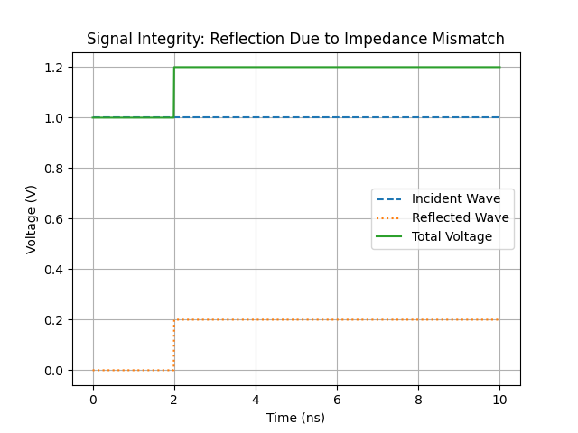
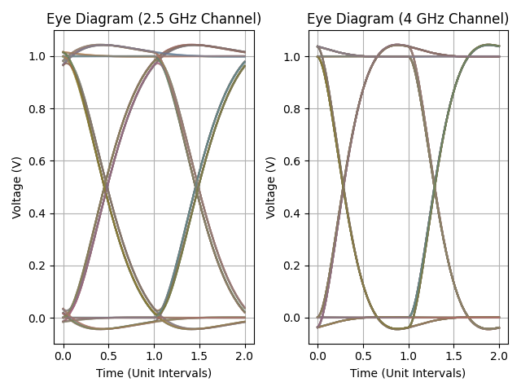
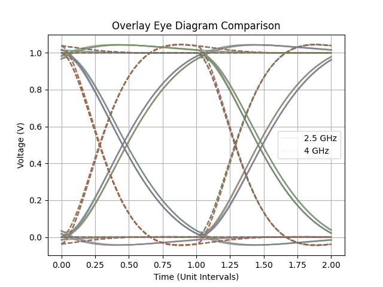
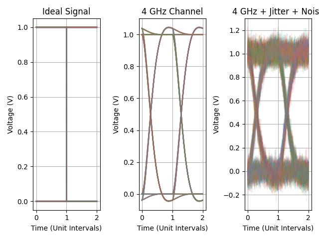
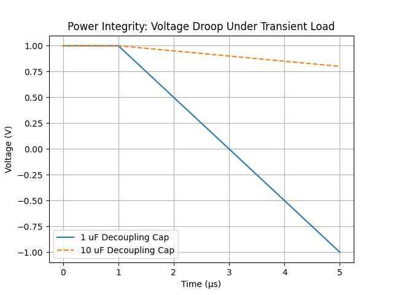
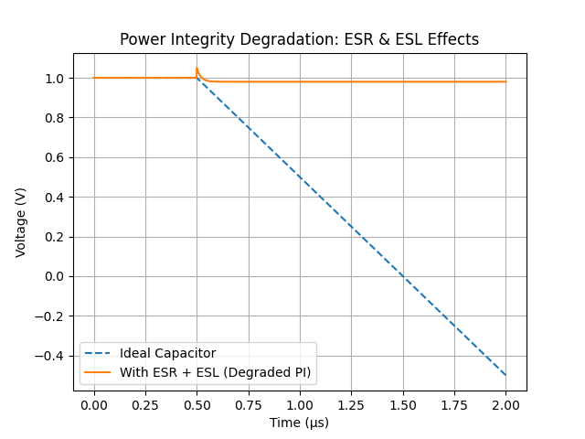

# Signal Integrity (SI) & Power Integrity (PI) Analysis of High-Speed Interconnects

## 📌 Overview

This project presents a compact yet comprehensive analysis of **signal integrity (SI)** and **power integrity (PI)** in high-speed digital systems.

It demonstrates how real-world non-idealities—such as **bandwidth limitation, jitter, noise, and parasitic elements (ESR/ESL)**—affect system performance using simulation-driven analysis.

---

## ⚙️ Objectives

* Analyze signal reflections due to impedance mismatch
* Visualize eye diagram degradation under realistic conditions
* Model transient behavior of power delivery networks (PDN)
* Demonstrate the impact of ESR and ESL on voltage stability

---

## 🧪 Project Components

---

### 1️⃣ Signal Integrity: Reflection Analysis

📄 Code: [`si_analysis.py`](./si_analysis.py)

🖼️ Output:



🔍 **Description**

* Models a transmission line with impedance mismatch
* Demonstrates signal reflection and waveform distortion

💡 **Insight**
Impedance mismatch produces reflections that lead to overshoot, ringing, and degraded signal quality.

---

### 2️⃣ Eye Diagram: Bandwidth Comparison (2.5 GHz vs 4 GHz)

📄 Code: [`eye_diagram_comparison.py`](./eye_diagram_comparison.py)

🖼️ Outputs:





🔍 **Description**

* Simulates a 5 Gbps NRZ signal
* Compares two channel bandwidths:

  * 2.5 GHz (bandwidth-limited)
  * 4 GHz (improved channel)

💡 **Insight**
Bandwidth limitation introduces **inter-symbol interference (ISI)**, reducing eye opening and degrading signal integrity.

---

### 3️⃣ Advanced Eye Diagram: Jitter + Noise

📄 Code: [`eye_diagram_advanced.py`](./eye_diagram_advanced.py)

🖼️ Output:



🔍 **Description**

* Adds timing jitter and Gaussian noise
* Simulates realistic high-speed signal impairments

💡 **Insight**

* Jitter → reduces timing margin (horizontal closure)
* Noise → reduces voltage margin (vertical closure)
* Combined → significant degradation and higher error probability

---

### 4️⃣ Power Integrity: Basic Analysis

📄 Code: [`pi_analysis.py`](./pi_analysis.py)

🖼️ Output:



🔍 **Description**

* Simulates voltage droop due to transient load
* Demonstrates effect of decoupling capacitance

💡 **Insight**
Larger capacitance improves voltage stability but does not capture real-world parasitics.

---

### 5️⃣ Power Integrity: ESR & ESL Effects (Degraded PDN)

📄 Code: [`pi_analysis_advanced.py`](./pi_analysis_advanced.py)

🖼️ Output:



🔍 **Description**

* Introduces ESR and ESL into decoupling model
* Simulates realistic PDN behavior under transient load

💡 **Insight**

* ESR → immediate voltage drop
* ESL → ringing and instability
* Parasitics dominate high-frequency performance

---

## 🔬 Key Concepts Covered

### 🔹 Signal Integrity

* Transmission line reflections
* Impedance mismatch
* Inter-symbol interference (ISI)
* Eye diagram interpretation

### 🔹 Power Integrity

* Voltage droop
* Decoupling strategies
* ESR (Equivalent Series Resistance)
* ESL (Equivalent Series Inductance)

---

## 📈 How to Interpret the Results

### Eye Diagrams

* **Eye Height** → Noise margin
* **Eye Width** → Timing margin
* Closed eye → degraded signal quality

### PI Plots

* Voltage droop → insufficient decoupling
* Ringing → inductive effects
* Instant drop → resistive losses

---

## 🛠️ Tools & Technologies

* Python
* NumPy
* SciPy
* Matplotlib

---

## 📁 Repository Structure

```
si-pi-fast-analysis-high-speed-link/
│
├── si_analysis.py
├── eye_diagram_comparison.py
├── eye_diagram_advanced.py
├── pi_analysis.py
├── pi_analysis_advanced.py
│
├── si_plot.png
├── eye_comparison.png
├── eye_overlay.png
├── eye_advanced.png
├── pi_plot.png
├── pi_degraded.png
│
└── README.md
```

---

## 🎯 Conclusion

This project demonstrates how key SI/PI impairments—bandwidth limitation, jitter, noise, ESR, and ESL—affect high-speed system performance.

It highlights the importance of **co-designing signal and power integrity** to ensure reliable operation in modern electronic systems.

---

## 🚀 Future Improvements

* Eye height/width extraction
* BER estimation
* Frequency-domain PDN impedance analysis
* Multi-capacitor decoupling optimization

---

## 💡 Summary

A simulation-driven exploration of how **real-world non-idealities impact signal quality and power stability** in high-speed digital designs.
